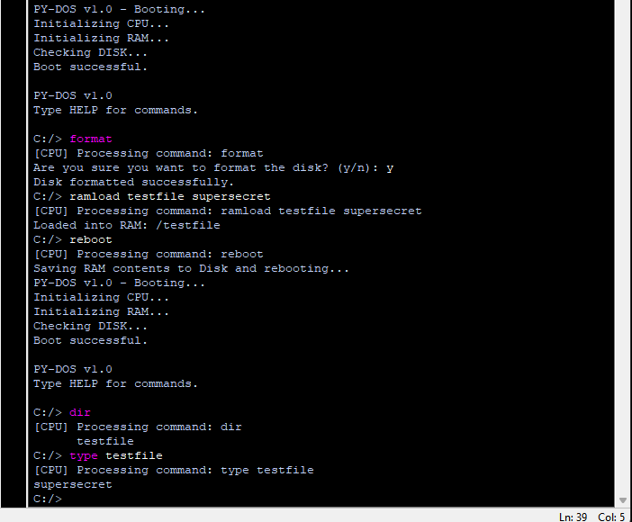

# PY-DOS 1.0.0

**PY-DOS** is a retro-inspired, terminal-based operating system simulation written entirely in Python.

It recreates the classic DOS experience while providing an educational and expandable platform for learning file systems, memory management, and command-line interfaces.

> Developed from scratch by **Ege**  
> Licensed under the **MIT License**

---

## Features

- Virtual RAM and Disk system (`ram.py`, `disk.py`)
- JSON-based disk storage (simulating 512 MB)
- File & folder commands: `MKDIR`, `CD`, `TREE`, `COPY`, `RENAME`, etc.
- CPU and RAM simulation with basic cycle tracking (`cpu.py`, `ram.py`)
- Command-line interface with keyboard input
- Modular and expandable code structure

---

## Technical Details

- PY-DOS uses a **"128 MB RAM simulation"** and a **512 MB "virtual disk"** (`disk.json`)
- The disk is JSON-based and saves automatically after a **REBOOT**
- If you use `RAMLOAD` and can’t see the file in disk, just run `REBOOT` to commit RAM to disk
- All data is saved between sessions through `disk.json`

---

## Requirements

- Python 3.8 or later
- Works on Windows, Linux, and macOS (platform-independent)

---

## Screenshots

> 

---

## All Commands

- DIR - List files and directories
- TYPE <file> - Show file content
- WRITE <file> <txt> - Write text to a file
- DEL <file> - Delete a file
- RENAME <old> <new> - Rename a file
- COPY <src> <dst> - Copy a file
- MKDIR <folder> - Create a new directory
- CD <folder> - Change current directory
- TREE - Display directory tree
- RAMLOAD <k> <v> - Load a key-value into RAM
- RAMCLEAR - Clear all RAM
- RAMSHOW - Display RAM contents
- SYSINFO - Display system information
- REBOOT - Save RAM to disk and reboot the system
- FORMAT - Format (reset) the disk
- PRINT - Print text to screen
- EXIT - Exit PY-DOS
